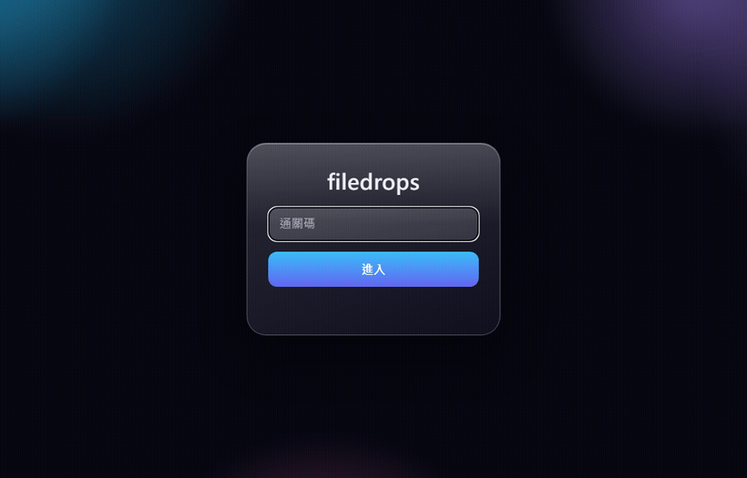
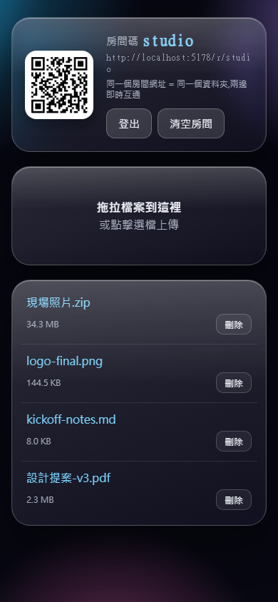

# filedrops

A small self-hosted file relay. Run it on one machine; open a room URL — or scan
its QR — on any other device, and move files both ways, right in the browser. The
other end installs nothing: no app, no account, no sign-in. Just a shared passphrase.

<p align="center">
  <br>
  
</p>

## The idea

Keep filedrops running on a machine you control — a laptop, a home server, or a
box exposed through Cloudflare Tunnel. When you need to move a file to or from
another device (your phone, a client's PC, a public computer), open the room in
its browser or scan the QR shown on screen. Both ends are looking at the same
room: drop a file on one side, download it on the other. Because each end is just
a web page, the only thing the other device needs is a browser.

Rooms are folders on disk. Files stay until you remove them. There is no database.

> The web UI speaks English and Traditional Chinese; every page has a one-click
> language switcher. See [Languages](#languages).

## How it works

- **One passphrase gate** protects the whole tool. Passing it sets a long-lived
  HMAC-signed cookie (`fd_auth`), so your own devices only ask once.
- A **room** is just a folder on disk: `DATA_DIR/<room-code>/`. Open
  `/r/<code>` and everyone on that URL sees the same files.
- **No realtime infra** — the room page polls the file list every 4 seconds.
- **Filesystem is the only store.** No database, no Redis. Each room folder holds
  the uploaded files (named by a random server-generated id) plus a `.meta.json`
  mapping id → original name/size/mime/time.

## Quick start (run it, share on your LAN)

The most common setup: run filedrops on one machine — your Mac, a Linux box, a
Windows PC — and let anyone on the same network use it through a browser. Same
steps on every OS.

```bash
git clone https://github.com/romanticamaj/filedrops.git
cd filedrops
npm install
cp .env.example .env
```

Edit `.env`: set `ACCESS_PASSPHRASE` and `COOKIE_SECRET`, pick a `PORT` (e.g.
`5178`), and set `SECURE_COOKIE=false` (required for plain-http LAN use). Then
start it — `npm run local` loads `.env` via Node's built-in `--env-file`, no
extra dependency:

```bash
npm run local
```

Prefer not to keep a `.env` file? Pass the vars inline for a one-shot run.
On **macOS / Linux** (bash/zsh):

```bash
ACCESS_PASSPHRASE=your-passphrase SECURE_COOKIE=false PORT=5178 \
  COOKIE_SECRET=$(node -e "console.log(require('crypto').randomBytes(32).toString('hex'))") \
  node server.js
```

On **Windows PowerShell** (the `VAR=value cmd` form above is bash-only):

```powershell
$env:ACCESS_PASSPHRASE='your-passphrase'; $env:SECURE_COOKIE='false'; $env:PORT='5178'
$env:COOKIE_SECRET=(node -e "console.log(require('crypto').randomBytes(32).toString('hex'))")
node server.js
```

> Inline secrets land in your shell history, and a freshly generated
> `COOKIE_SECRET` logs everyone out on each restart — fine for a quick test; use
> `.env` for anything you run repeatedly.

On startup filedrops prints the URLs other devices can actually use — your
**Network** (LAN) address and **Tailscale** address if present:

```
filedrops is running.

Open on any device (passphrase required):

  Network     http://192.168.1.23:5178   Wi-Fi
  Tailscale   http://100.x.y.z:5178      Tailscale

Pick the Wi-Fi / Ethernet one (not a VirtualBox/WSL/hotspot adapter).
```

The last column is the network adapter. Pick your real **Wi-Fi** or **Ethernet**
one — a `192.168.x.1` on a VirtualBox / WSL / hotspot adapter is a separate virtual
subnet other devices can't reach. Open the chosen URL on the host machine too
(**not** `localhost`) so the room's QR encodes a shareable address. To look the IP
up yourself instead:

| OS | Get your LAN IP |
|---|---|
| **macOS** | `ipconfig getifaddr en0` (Wi-Fi; try `en1` if empty) |
| **Linux** | `hostname -I` |
| **Windows** | `ipconfig` → IPv4 Address |

Open that URL (or scan a room's QR) on the other device, enter the passphrase,
and you're in the same room. Drop a file on one side; download it on the other.

**Firewall:** the first time another device connects, your OS may ask whether to
allow incoming connections for `node` — allow it. macOS shows a dialog (or add it
under System Settings → Network → Firewall). On a Windows "Public" network you may
need the rule in [Access modes](#access-modes). The connecting devices never need
any firewall change.

> `SECURE_COOKIE=false` is required for plain-http LAN use — browsers withhold
> `Secure` cookies over non-HTTPS. Keep it `true` only when serving over HTTPS
> (e.g. behind Cloudflare Tunnel).

## Usage

- **Create a room** — you're redirected to `/r/<random-code>`.
- **Fixed room** — visit `/r/<your-code>` (e.g. `/r/team-7x2`) and memorize it.
  Type the same URL on any machine; there's no code to pass around.
- **Share** — the room header shows a QR of its URL. Scan it on a logged-out
  device and you land on the passphrase page, then go **straight into that room**
  (no bounce to the home page). Sharing with someone else means giving them the
  passphrase and the room URL.
- **Upload** — drag files onto the drop zone, or click to pick them. Each file
  shows its own progress bar; the other side sees it within ~4s.
- **Manage files** — delete a single file, or clear the whole room.

## Languages

The UI ships in English (`en`, default) and Traditional Chinese (`zh-Hant`).
The language is resolved per request, first match wins:

1. `?lang=en` / `?lang=zh-Hant` in the URL. The choice is stored in a cookie
   and the parameter is stripped with a redirect, so a copied room URL never
   forces a language on whoever you paste it to.
2. The language cookie (`LANG_COOKIE`, default `fd_lang`).
3. The browser's `Accept-Language` header (`zh`, `zh-TW`, `zh-HK`, `zh-MO` and
   `zh-Hant` map to Traditional Chinese).
4. English.

The switcher in the top-right corner of every page is a plain link, so it works
with JavaScript disabled, including on the passphrase gate. Pages are rendered
per language once at server start; if you edit the HTML under `public/`,
restart the server to see the change.

To add a language: copy `locales/en.json` to `locales/<tag>.json`, translate
the values (same keys), add the tag to `LANGS` in `lib/i18n.js` and the file to
its `DICT`, map the browser tags you want in `fromAccept()`, and turn the
single switcher anchor into one link per other language.

## Room lifecycle

- Files persist until you delete them or clear the room — nothing auto-expires
  while a room still has files.
- An **empty** room whose folder has been idle longer than `ROOM_IDLE_DAYS`
  (default 7) is removed by an hourly cleanup pass. Rooms with files are never
  auto-removed.

## Access modes

filedrops is just an HTTP server on `localhost:PORT`. A tunnel is only **one** way
to reach it — pick the mode that fits who needs access and from where. The server
listens on all interfaces, so modes 1 and 2 need no extra software on the host.

**1. Same network / on-site — no tunnel, no internet.**
Run it on your laptop on any Wi-Fi (home, coworking space, a client's office).
Any device on the same network opens `http://<host-ip>:PORT` (find the host IP
with `ipconfig` on Windows / `ip addr` on Linux). Nothing leaves the local
network — ideal for moving files around on-site with no internet at all. Bring
the laptop, join the client's Wi-Fi, and everyone on it can transfer through you.

**2. Your own devices, anywhere — Tailscale, no tunnel.**
If your machines share a [Tailscale](https://tailscale.com) tailnet, any of them
reaches `http://<tailscale-ip>:PORT` from anywhere (even on cellular), with no
public domain and no tunnel. Best when both ends are *your* devices — e.g. your
phone and your work laptop at a client site.

**3. Anyone with the passphrase — Cloudflare Tunnel, public.**
To let someone who is *not* on your LAN or tailnet reach it from any browser,
expose it publicly at your own domain with Cloudflare Tunnel (see
[Deploy on Windows](#deploy-on-windows-persistent)). This is the only mode that
needs a tunnel.

> **Firewall — host only, and only for LAN mode.** Connecting devices *never* need
> a firewall change; they only make outbound requests. Only the **host** (the
> machine running filedrops) may need to allow inbound on the port, and only in
> mode 1 (LAN). Windows usually pops an "Allow access" prompt the first time the
> server listens — accept it for **Private** networks. If a client's Wi-Fi is
> treated as **Public** and the connection is blocked, add the rule manually
> (elevated):
> `netsh advfirewall firewall add rule name="filedrops" dir=in action=allow protocol=TCP localport=PORT`
> Cloudflare Tunnel needs no inbound rule at all (cloudflared dials outward), and
> Tailscale usually works without one too.

## Environment

| Var | Default | Meaning |
|---|---|---|
| `PORT` | 3000 | Local listen port |
| `ACCESS_PASSPHRASE` | (required) | Site-wide gate passphrase |
| `COOKIE_SECRET` | (required) | HMAC secret for the auth cookie |
| `DATA_DIR` | ./data | Where room folders live |
| `MAX_FILE_MB` | 2048 | Per-file upload cap |
| `ROOM_IDLE_DAYS` | 7 | Empty rooms older than this are auto-removed |
| `COOKIE_MAX_AGE_DAYS` | 90 | Auth cookie lifetime |
| `SECURE_COOKIE` | true | Marks the auth cookie `Secure` (HTTPS-only); set `false` only for local http testing |
| `LANG_COOKIE` | fd_lang | Name of the cookie that remembers the language choice |
| `LANG_COOKIE_DOMAIN` | (unset) | `Domain` attribute for that cookie; leave unset for host-only |

### Secrets: `ACCESS_PASSPHRASE` vs `COOKIE_SECRET`

Both are required, but they play different roles:

- **`ACCESS_PASSPHRASE`** — the gate passphrase people type to get in. You choose
  it, remember it, and share it with anyone you let in. Make it long enough not to
  guess. This is the only secret a human ever handles.
- **`COOKIE_SECRET`** — a server-side key that signs the login cookie (HMAC), so
  the server can tell a genuine login from a forged one. Nobody types it; it just
  needs to be a random, secret string. Generate one with:
  ```bash
  node -e "console.log(require('crypto').randomBytes(32).toString('hex'))"
  ```
  Changing it invalidates every existing login cookie — everyone re-enters the
  passphrase once. Leaking it lets someone forge a login and bypass the passphrase,
  so keep it out of the repo (it lives in `.env`, which is git-ignored).

## Deploy on Windows (persistent)

### 1. Cloudflare Tunnel

```powershell
winget install --id Cloudflare.cloudflared
cloudflared tunnel login
cloudflared tunnel create filedrops
```

Create `%USERPROFILE%\.cloudflared\config.yml`:

```yaml
tunnel: filedrops
credentials-file: C:\Users\<you>\.cloudflared\<tunnel-id>.json
ingress:
  - hostname: drop.example.com
    service: http://localhost:3000
  - service: http_status:404
```

Route DNS and install the tunnel as a service:

```powershell
cloudflared tunnel route dns filedrops drop.example.com
cloudflared service install
```

### 2. Node app as a Windows service (nssm)

```powershell
winget install nssm
nssm install filedrops "C:\Program Files\nodejs\node.exe" "D:\projects\filedrops\server.js"
nssm set filedrops AppDirectory "D:\projects\filedrops"
nssm set filedrops AppEnvironmentExtra ACCESS_PASSPHRASE=your-passphrase COOKIE_SECRET=your-random-secret DATA_DIR=D:\projects\filedrops\data
nssm start filedrops
```

Values set via `nssm set filedrops AppEnvironmentExtra ...` (the passphrase and
cookie secret) are stored in the Windows registry and readable via
`nssm dump filedrops` by anyone with admin on the box — treat them as secrets and
restrict admin access.

Both services now start on boot and restart on crash. Verify by visiting
https://drop.example.com — it should prompt for the passphrase over HTTPS.

## Security notes

- The passphrase gate protects the whole tool; the `noindex` header + robots.txt
  keep it out of search engines. Sharing a room = sharing the passphrase + room URL.
- Room codes are unguessable random strings; each recipient only sees the room
  URL you send them.
- The passphrase gate is protected by a lightweight in-memory rate limit
  (10 attempts / 5 min / IP) and uploads by 60 / min / IP; for stronger protection
  add a Cloudflare WAF rate-limit rule on `drop.example.com`.
- Uploaded files are stored under a random server-generated id, never the
  user-supplied filename, so a malicious name can't escape `DATA_DIR`. The post-
  login redirect only accepts same-site paths (no open redirect).

## Testing

```bash
npm test        # node --test — 65 tests, no external services
```

## Project layout

```
server.js          entry: load config, create app, hourly cleanup, listen
app.js             createApp(config): gate, requireAuth, static, error handler
routes/rooms.js    roomsRouter(config): create/list/upload/download/delete/clear/qr
lib/config.js      env → config object
lib/auth.js        constant-time passphrase check + HMAC signed cookie
lib/rooms.js       room-code generation + path-traversal-safe roomDir()
lib/storage.js     per-room .meta.json + file lifecycle (serialized writes)
lib/cleanup.js     idle empty-room removal
lib/ratelimit.js   tiny in-memory per-IP limiter
lib/i18n.js        flat-JSON locale lookup + {{key}} template render + language pick
locales/           en.json, zh-Hant.json (one flat object per language)
lib/addresses.js   reachable URLs (Local / Network / Tailscale) for the banner
public/            gate.html, index.html, room.html, app.js (client)
public/glass.css   shared liquid-glass styling
public/vendor/     liquid-glass.js (MIT, vendored, no CDN)
test/              node:test suites (one per module + route/gate/qr)
docs/              build-harness spec
```

## Similar tools

If you want a polished, app-based transfer tool, look at
[LocalSend](https://localsend.org) or [PairDrop](https://pairdrop.net).
filedrops is deliberately minimal and browser-only — its one trick is that the
other end needs nothing but a browser (or a QR scan), which is handy for public or
borrowed computers where you can't install anything.

## License

MIT — see [LICENSE](LICENSE).
